## object/objet_adornments

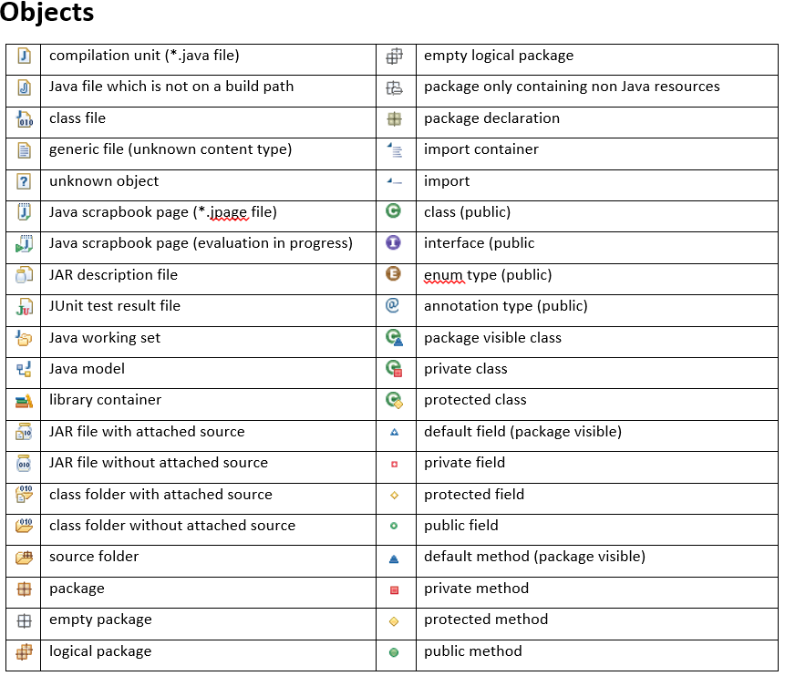

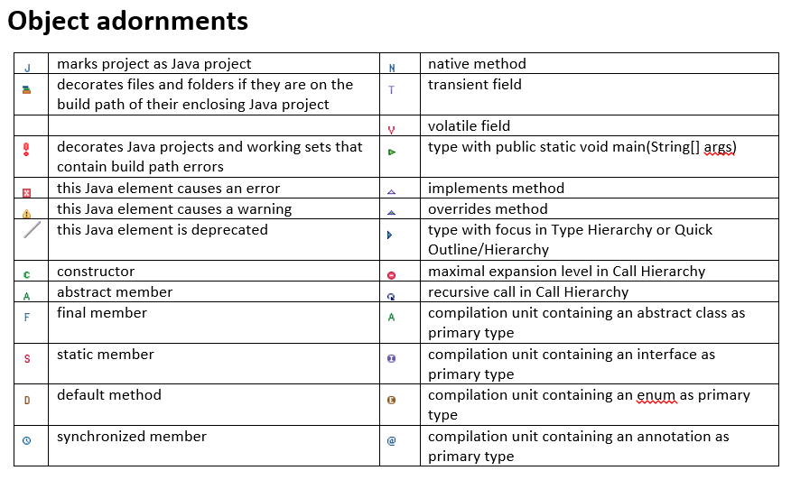

## レポジトリ作成とコミット

```チーム``` > ```プロジェクトの共用```から順に進む。

1...   
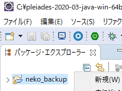

2...   
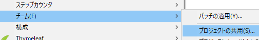

3...   
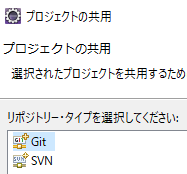

4...   
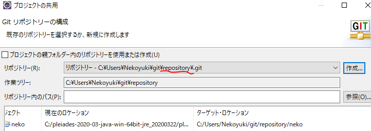

で、ここの```repository```名が、最終的に、```Github```上のレポジトリ名となるのでよー考えて名前をつける。

で、ここの```repository```の下にプロジェクトが置かれる。感じ。

できると、下記のように```パッケージ・エクスプローラー```の表示が変わる。

5...   
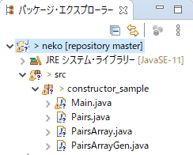

```チーム``` > ```コミット```でコミットする。
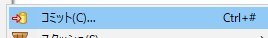

## clone

1...```Git```押す   

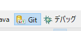

2...```クローン```押す   


3...```URL```いれる   

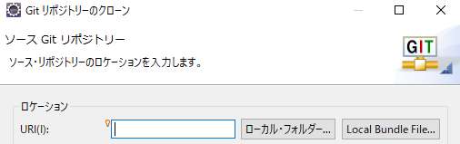

4...```次へ```押す   

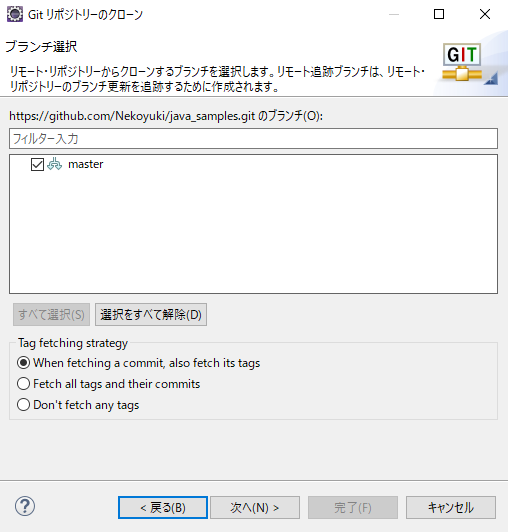

5... ```完了```押す  

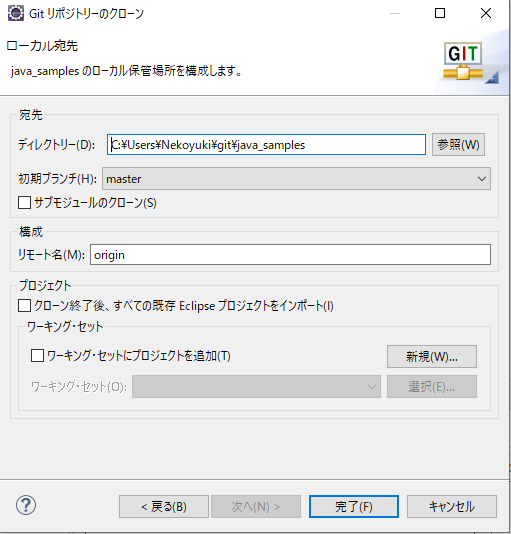

6...終わり。   

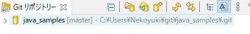

7...で、インポート   

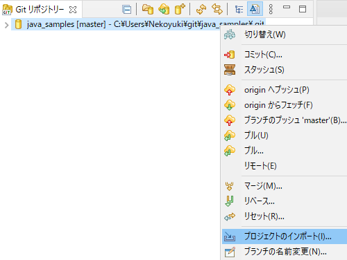

8...下のチェックの方だけインポートする   

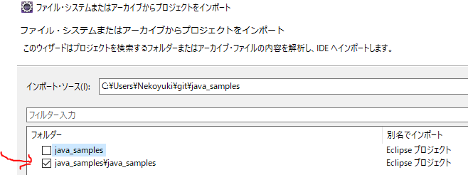

9...終わり。   

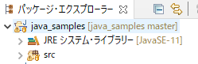

