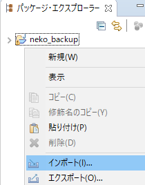

### object/objet_adornments


### レポジトリ作成とコミット

```チーム``` > ```プロジェクトの共用```から順に進む。

1...   


2...   


3...   


4...   


で、ここの```repository```名が、最終的に、```Github```上のレポジトリ名となるのでよー考えて名前をつける。

できると、下記のように```パッケージ・エクスプローラー```の表示が変わる。

5...   


```チーム``` > ```コミット```でコミットする。


### clone

```インポート```からやる。




