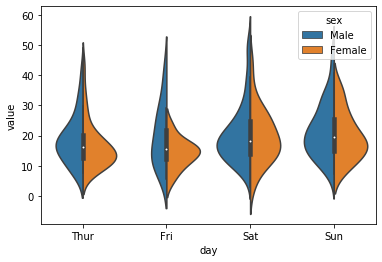

### お絵描き
Boxplot/hist + figsize変更 + Y軸調整

```python
In [63]: import seaborn as sns

In [64]: df = sns.load_dataset('iris')

In [66]: df.boxplot()

In [67]: df.hist()

In [68]: import matplotlib.pyplot as plt

In [46]: plt.figure(figsize=[5,5]); plt.ylim([0,3]); df.boxplot()
```

```fig```, ```ax``` を使う場合

```python
In [47]: fig = plt.figure(); ax = fig.add_subplot(111); ax.tick_params(colors='white'); df.plot(ax=ax)
```

```lenged``` を外に出す

```python
In [48]: fig, ax = plt.subplots(); df.plot(ax=ax); ax.legend(bbox_to_anchor=(1.4,1), loc='upper right')
```

```savefig()```する時に、```legend```がはみ出ないようにするおまじない
```python
In [49]: fig, ax = plt.subplots(); df.plot(ax=ax); lgd = ax.legend(bbox_to_anchor=(1.4,1), loc='upper right'); fig.savefig('aaa.png', bbox_extra_artists=(lgd,), bbox_inches='tight')
```

### 調整

```python
plt.figure(figsize=[5,5])           # キャンバスサイズ
plt.title('hageX', fontsize=30)     # タイトル
plt.ylim([0,3])                     # Yの値の最小、最大値
plt.xlabel('hage', fontsize=30)     # Xラベル
plt.tick_params(axis='x', labelsize = 10, labelrotation=90, colors='white')     # 軸ラベルの調整
plt.yticks([0, 0.5, 1.0])           # Yグリッド
plt.tight_layout()                  # うまいこと出力図の範囲を綺麗に収める
plt.text(2.0, -0.4, 'hage', fontsize=15)    # テキスト
plt.close(fig)                      # Figureを閉じる... これやらないと、メモリオーバフローになることあるっす。
```

[tick_params](https://matplotlib.org/3.1.0/api/_as_gen/matplotlib.pyplot.tick_params.html)

```python
ax.set_title('hage')
ax.set_xlabel('hage')
ax.set_xlim(0,1)
ax.tick_params(labelrotation=45)
ax.get_figure().savefig('hage')

```

### 画像の保存

```python
tips.groupby('day').mean()['total_bill'].plot(kind='bar').get_figure().savefig('hage.png')
```

### Color example

[Color example](https://matplotlib.org/examples/color/colormaps_reference.html)

### violinplot
x/y/data、をきちんと指定する必要あり。meltで一次元のシリーズに変換要。

```python
In [78]: iris.head()
Out[78]:
   sepal_length  sepal_width  petal_length  petal_width species
0           5.1          3.5           1.4          0.2  setosa
1           4.9          3.0           1.4          0.2  setosa
2           4.7          3.2           1.3          0.2  setosa
3           4.6          3.1           1.5          0.2  setosa
4           5.0          3.6           1.4          0.2  setosa

In [80]: irisx = df.drop('species', axis=1).melt()

In [81]: irisx.head()
Out[81]:
       variable  value
0  sepal_length    5.1
1  sepal_length    4.9
2  sepal_length    4.7
3  sepal_length    4.6

In [87]: sns.violinplot(data=irisx, x='variable', y='value')
```

### violinplot 2
```pd.melt()```を使う

```python
In [16]: tips = sns.load_dataset('tips')

In [17]: tips.head()
Out[17]: 
   total_bill   tip     sex smoker  day    time  size
0       16.99  1.01  Female     No  Sun  Dinner     2
1       10.34  1.66    Male     No  Sun  Dinner     3
2       21.01  3.50    Male     No  Sun  Dinner     3
3       23.68  3.31    Male     No  Sun  Dinner     2
4       24.59  3.61  Female     No  Sun  Dinner     4

In [19]: pd.melt(frame=tips, id_vars=['day', 'sex'], value_vars=['total_bill'])
Out[19]: 
      day     sex    variable  value
0     Sun  Female  total_bill  16.99
1     Sun    Male  total_bill  10.34
2     Sun    Male  total_bill  21.01
3     Sun    Male  total_bill  23.68
4     Sun  Female  total_bill  24.59
..    ...     ...         ...    ...
239   Sat    Male  total_bill  29.03
240   Sat  Female  total_bill  27.18
241   Sat    Male  total_bill  22.67
242   Sat    Male  total_bill  17.82
243  Thur  Female  total_bill  18.78

[244 rows x 4 columns]

In [23]: sns.violinplot(data=pd.melt(frame=tips, id_vars=['day', 'sex'], value_vars=['total_bill']), x='day', y='value', hue='sex', split=True)
Out[23]: <matplotlib.axes._subplots.AxesSubplot at 0x1989268ce88>
```


### リンク

https://matplotlib.org/3.1.0/index.html
