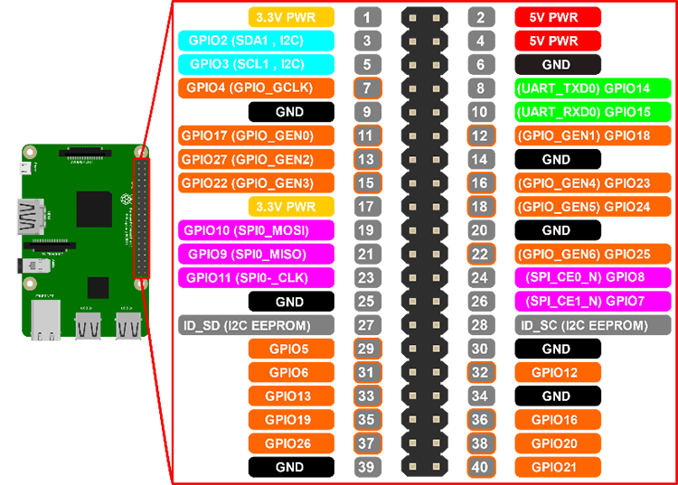

### 

## セットアップ

pyhton3にする

```bash
cd /usr/bin
sudo unlink python
sudo ln -s python3 python
```
zshにする

```bash
sudo vi /etc/pam.d chsh
# auth required pam_shells.so # comment out

chsh -s /usr/bin/zsh
```

固定IP設定

```bash
sudo vi /etc/dhcpdc.conf
interface eth0
static ip_address=xx.xxx.xxx.xxx/xx
static routers=xxx.xxx.xxx.xxx
static domain_name_servers=xxx.xxx.xxx.xxx

hostname変更

```bash
sudo vi /etc/hostname
sudo vi /etc/hosts
hoge.hoge.com
```

日付更新

```bash
sudo date --set='yyyy/mm/dd hh:mm:ss'
```

プロキシ内からaptをできるようにする

```bash
sudo vi /etc/apt/apt.conf
Acquire::http::proxy "http://hoge.hoge.com:8080/";
Acquire::https::proxy "https://hoge.hoge.com:8080/";
Acquire::ftp::proxy "ftp://hoge.hoge.com:8080/";
Acquire::socks::proxy "socks://hoge.hoge.com:8080/";
```

いろいろアップデート

```bash
sudo apt-get update
sudo apt-get install -y zsh
sudo apt-get install -y fzy
sudo apt-get install -y vim
sudo reboot
```


## リンク

[Raspberry Pi/はじめにやること](https://www.angelcurio.com/raspberrypi/?Raspberry%20Pi/%E3%81%AF%E3%81%98%E3%82%81%E3%81%AB%E3%82%84%E3%82%8B%E3%81%93%E3%81%A8)

[Raspbian のシェルを zsh に変更する手順](https://utano.jp/entry/2017/12/raspbian-zsh/)

[Raspberry Pi 4にSSHとVNCで接続してみた](https://dev.classmethod.jp/articles/raspberry-pi-4-ssh-vnc-remote/)

## GPIO

[DOCUMENTATION>USAGE>GPIO](https://www.raspberrypi.org/documentation/usage/gpio/)



[Raspberry PiでPythonのRPi.GPIOを使ってLチカする](https://qiita.com/masato/items/715e28e0c0c945a54297)

[Raspberry Pi のGPIOをPythonから利用する](https://qiita.com/maoutokagura/items/9aef5e23167ce2bc1d10)

[Raspberry PiのGPIO端子のスイッチ入力](https://qiita.com/rockhopper-penguin/items/fd3fe09cdbd04b2a5f86)

## 熱電対(thermal couple)

[熱電対でデータ取得](https://qiita.com/tm_nagoya/items/501b558dab5f427e1d98)

[秋月電子/熱電対/MAX31855](https://akizukidenshi.com/catalog/g/gM-12101/)


### リンク

[エンジニアの電気屋さん](https://misoji-engineer.com/)

