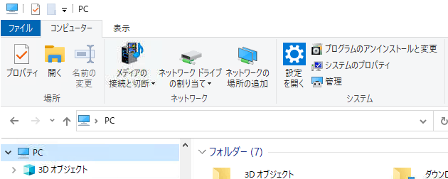
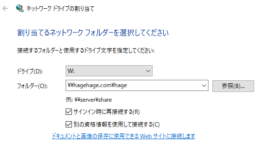
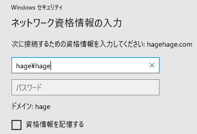

### Resource

[Sambaサーバーの設定手順(Ubuntu18.04)とWindowsからのアクセス方法](https://aquarius-train.hatenablog.com/entry/Samba%E3%82%B5%E3%83%BC%E3%83%90%E3%83%BC%E3%81%AE%E8%A8%AD%E5%AE%9A%E6%89%8B%E9%A0%86%E3%81%A8Windows%E3%81%8B%E3%82%89%E3%81%AE%E3%82%A2%E3%82%AF%E3%82%BB%E3%82%B9%E6%96%B9%E6%B3%95)

### 監視
```sh
systemctl status smbd
```

### 設定ファイル

```sh
v /etc/samba/samba.conf
v /var/log/samba/smbd.log
```

```samba.conf```のみかた   
```
[global]
        workgroup = HAGE                    << = Windows/Domain_name
        server string = HAGE hage group
        netbios name = HAGE
        interfaces = lo eth
        hosts allow = ALL
        hosts deny = ALL
        log file = /var/log/samba/%m.log
        log level = 1 auth:2
        max log size = 50
        security = user
        passdb backend = tdbsam
        local master = no
        wins support = no
        wins proxy = no
        dns proxy = yes
        load printers = no
        template shell = /bin/false
        winbind use default domain = no
        lanman auth = no
        lm announce = no
        unix extensions = no
        socket options = TCP_NODELAY
        map to guest = bad user
        preferred master = no
        domain master = no
        local master = no
        domain logons = no
        server role = STANDALONE

[hage]
comment = Hage one
browsable = yes
writable = yes
path = /home/hage
wide links = no
invalid users = root
valid users = hage      << user who can access to the folder "hage"
guest ok = no
create mask = 0664
directory mask = 0775
force create mode = 0664
force directory mode = 0775
force group = root
force user = root
delete readonly = yes
```

### Windows側の設定

ネットワークドライブの割り当てを開く   
   


ネットワークフォルダーを選択する   
別の資格情報を使用して接続するにチェックをする   
   


ドメイン名をユーザ名の前に入れる   
   

